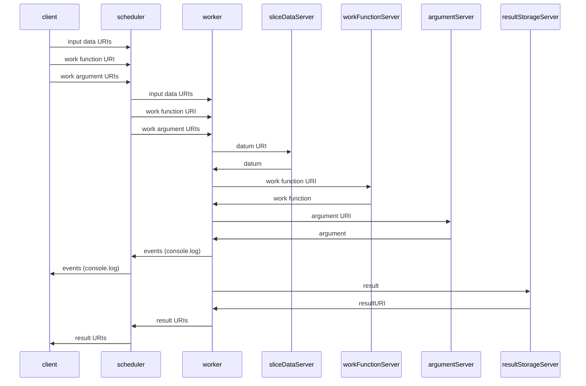

# DCP Slice Service

This is the official reference implementation for a DCP Slice Service.  While it *can* be used as a production service, its purpose is to demonstrate how to write a slice service for DCP.

## Record Of Issue
| Date       | Author              | Change
:----------- |:------------------- |:---------------------------------------------
| Oct 5 2021 | Wes Garland         | Initial Release

## Legal
Copyright (c) 2021 Kings Distributed Systems, Ltd.

Permission is hereby granted, free of charge, to any person obtaining a copy of this software and associated documentation files (the "Software"), to deal in the Software without restriction, including without limitation the rights to use, copy, modify, merge, publish, distribute, sublicense, and/or sell copies of the Software, and to permit persons to whom the Software is furnished to do so, subject to the following conditions:

The above copyright notice and this permission notice shall be included in all copies or substantial portions of the Software.

THE SOFTWARE IS PROVIDED "AS IS", WITHOUT WARRANTY OF ANY KIND, EXPRESS OR IMPLIED, INCLUDING BUT NOT LIMITED TO THE WARRANTIES OF MERCHANTABILITY, FITNESS FOR A PARTICULAR PURPOSE AND NONINFRINGEMENT. IN NO EVENT SHALL THE AUTHORS OR COPYRIGHT HOLDERS BE LIABLE FOR ANY CLAIM, DAMAGES OR OTHER LIABILITY, WHETHER IN AN ACTION OF CONTRACT, TORT OR OTHERWISE, ARISING FROM, OUT OF OR IN CONNECTION WITH THE SOFTWARE OR THE USE OR OTHER DEALINGS IN THE SOFTWARE.

## About
A DCP Slice Service consists of two parts,

 1. a program which can receive slice data from a remote entity (to later give to workers), and
 2. and a program which can send this data to workers when they ask for it

For the reference implementation, we have chosen to write both #1 and #2 into a single Node.js program. We foresee many implementations where #1 and #2 are nothing more than `ftpd` and `httpd` with carefully-crafted file extensions and `mime.types`.

## Interface
1. An HTTP POST is made to the server (dcp-slice-httpd), which records the slice data to disk. The server
   responds with HTTP status 200, content-type `application/json`; the response body is a JSON-stringified object.
2. Workers make an HTTP GET request to dcp-slice-httpd, which responds with the slice data on disk.

### methods/upload
#### POST Parameters
##### job
This is a unique identifier for the job. It can be any unique string that describes the data that the job is for.  Future versions of DCP will support UUIDs which are calculated for jobs before deployment; this would be a good choice for this parameter.

##### slice
This is a unique identifier for the slice. When used as part of a pattern URI in a `compute.RemoteDataPattern`, it should be the slice number. Slices numbers start a 1 and increment by one for each slice.

##### datum
This is the input set datum for this slice.  When this parameter is used, the uploaded datum will not be interpreted in any way; the worker will receive exactly the same bytes for this slice as the dcp-slice-service daemon did. The content-type will also be preserved from the upload, however, note that is it possible for both this server and intermediary web servers and caches to transparently alter the content transfer encoding, etc.

##### contentType
The content type of the datum, after it has been decoded from the form upload.

#### Response
##### Successful
| Property | Value
|:---------|:------------------------------------------------------------------------------
| success  | true
| href     | a full URL which gives the path from which this datum may be downloaded

##### Failure
| Property | Value
|:---------|:------------------------------------------------------------------------------
| success  | false
| error    | optional instance of Error.  If present, may have also have non-standard stack and code properties.

#### Integration with compute::RemoteDataPattern
Provided both the job and slice parameters were passed to this method, the datum will be in a deterministic location, given by
`${website origin}/methods/download/jobs/${job}/${slice}`

#### Integration with compute::RemoteDataSet
In all cases, the response indicates the location from which the uploaded datum can be retrieved.

When either the job or slice parameters are missing, a the slice service will generate a random identifier to take its place. This allows the uploading of slice data which
have not yet been associated with input set by the client developer, but makes it imperative that the href URL in the reponse is memoized so that the data can be located later
when the input set is constructed.

### methods/upload-set
#### POST Parameters
##### job
See: methods/upload

##### data
Specifies the entire input set for this job and must be an Object which has been serialized either with JSON or KVIN. Serialization type will be automatically detected, but any data type which requires application/x-kvin output (eg TypeArrays, see table below) must be uploaded in KVIN to preserve type information correctly.

The service will intelligently decide how to store the data on disk, and will serialize it for transmission to the worker using whatever serialization is appropriate for the content type.

##### contentType
The content type of the data will be automatically determined after it has been extracted from the uploaded Array, evaluated on
a per-datum basis. If the initial serialization is done correctly, the JS type used in the uploaded Array will be the samme as the JS
type the Worker receives as its work function argument (slice datum).

The following table lists the internal representation which is used to achieve this, but should be considered an implementation detail.
The table is traversed in top-to-bottom order, with the first match being used.

| **JS Type** | **MIME Type** 
|:------------|:----------------------------------
| string      | text/plain
| number < Infinity, > -Infinity | application/x-json
| number      | application/x-kvin
| Uint8Array  | application/octet-stream
| TypedArray  | application/x-kvin
| other       | application/x-kvin

#### Response
##### Successful
| Property | Value
|:---------|:------------------------------------------------------------------------------
| success  | true
| pattern  | a pattern string which can be used to retrieve this data, suitable for use with compute::RemoteDataSet
| length   | number of slices in the request

##### Failure
| Property | Value
|:---------|:------------------------------------------------------------------------------
| success  | false
| error    | optional instance of Error.  If present, may have also have non-standard stack and code properties.

### Content-Types
DCP workers uses the HTTP content-type header to sort out what kind of serialization (if any) is in use for a given HTTP request.  (See: `fetchURI()`)

| **MIME Type**                      | **Return Type**
|:-----------------------------------|:-------------------------------------------------------------------------------------------------
| text/plain or none                 | string primitive |
| text/*                             | An instance of String with the contentType property set, and the charset property set if it was specified
| application/json                   | whatever JSON.parse returns on the data when it is treated as a string
| application/x-kvin                 | whatever kvin.deserialze returns on the data when it is treated as a string
| image/*                            | A Uint8Array of the decoded contents with the contentType property set.
| application/octet-stream           | A Uint8Array of the decoded contents with the contentType property set and the charset property set if it was specified.
| Anything else                      | Same as application/octet-stream

## Installing
- configure Apache to proxy somehow
- something like

```bash
bash
export PREFIX="/var/dcp-slice-httpd"
sudo mkdir -p "${PREFIX}"
sudo apt-get install apache2 #ignore failures due to port 80 busy
sudo npm i dcp-slice-service --global --prefix="${PREFIX}"
sudo -k
exit
```

- now edit apache confs
- copy systemctl stuff
- systemctl daemon-reload
- systemctl start whatever this thing is call

## Appendix A - Manifest

| **Filename**                   | **Description**
|:-------------------------------|:----------------------------------------------------
| README.md                      | This document
| bin/dcp-slice-httpd            | Slice service daemon; web server written in Node.js
| etc/config.js                  | Configuration object
| etc/local-config.js            | If present, overrides to etc/config.js
| browser-test/upload.html       | Web page to upload data into the slice service

## Appendix B - Remote URI Data Movement
**Note:** It is possible to freely mix remote URI and scheduler-centric URIs (traditional DCP) within the same job, at will, on an ad-hoc basis.



## Appendix C - Compute API support for Remote Data
* RemoteDataSet
* RemoteDataPattern
* JobHandle.setResultStorage

```javascript
let job = compute.for(inputSet, new URL('http://my.site.com/work.js'));
```

```javascript
let { RemoteDataPattern } = require('dcp/compute');
let pattern = 'http://site.com/{slice}.json';
let job = compute.for(RemoteDataPattern(pattern, 2), function(el) { console.log(el)});
job.on('console', console.log)
await job.exec();
```

```
job.setResultStorage(new URL('https://192.168.123.1/submit-result'), { juuid: job.uuid });
```
<!--stackedit_data:
eyJoaXN0b3J5IjpbLTU5NTM2ODM2OSw0NzEwODIxMzEsLTE4NT
k2NDY1OTMsLTEwNTc4NDE4MzVdfQ==
-->
