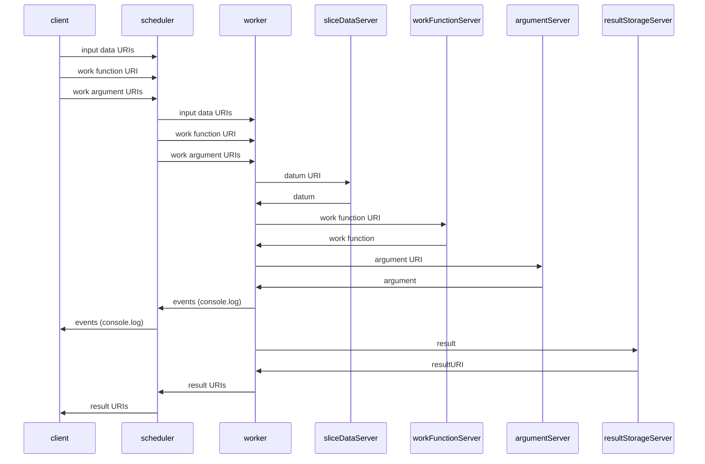

# DCP Slice Service

This is the official reference implementation for a DCP Slice Service.  While it *can* be used as a production service, its purpose is to demonstrate how to write a slice service for DCP. 

## Record Of Issue
Date | Author | Change  
:---------- |:------------------- |:---------------------------------------------  
Oct 5 2021 | Wes Garland | Initial Release

## About
A DCP Slice Service consists of two parts,

 1. a program which can receive slice data from a remote entity (to later give to workers), and
 2. and a program which can send this data to workers when they ask for it

For the reference implementation, we have chosen to write both #1 and #2 into a single Node.js program. We foresee many implementations where #1 and #2 are nothing more than `ftpd` and `httpd` with carefully-crafted file extensions and `mime.types`.

## Details
1. An HTTP POST is made to `${serverName}/methods/upload`, which sends the data to the slice service
2. The workers make an HTTP GET request to `${serverName}/methods/download`, which sends this data to the worker

### methods/upload
* HTTP POST method
* POST parameters: 
	* job, slice, datum, or
	* job, data

#### POST Parameter: job
This is a unique identifier for the job. It can be any unique string that describes the data that the job is for.  Future versions of DCP will support UUIDs which are calculated for jobs before deployment; this would be a good choice for this parameter.

#### POST Parameter: slice
This is a unique identifier for the slice. When used as part of a pattern URI in a `compute.RemoteDataPattern`, it should be the slice number. Slices numbers start a 1 and increment by one for each slice.

This parameter must be used in conjunction with `datum`.

#### POST Parameter: datum
This is the input set datum for this slice.  When this parameter is used, the uploaded datum will not be interpreted in any way; the worker will receive exactly the same bytes for this slice as the dcp-slice-service daemon did. The content-type will also be preserved, however, note that is it possible for both this server and intermediary web servers and caches to transparently alter the content transfer encoding, etc.

This parameter must be used in conjunction with `slice`.

#### POST Parameter: data
This specifies the entire input set for this job and must be an Object which has been serialized either with JSON or KVIN.  JSON data must have content-type application/json, where as KVIN data must have content-type application/x-kvin.

The service will intelligently decide how to store the data on disk, and will serialize it for transmission to the worker using whichever serialization was chosen for the POST operation.

#### Content-Types
DCP workers uses the HTTP content-type header to sort out what kind of serialization (if any) is in use for a given HTTP request.  (See: `fetchURI()`)

|**MIME Type**|**Return Type**|
|:--|:--|
|text/plain or none|string primitive
|text/*|A boxed string with the contentType property set, and the charset property set if it was specified, eg. `x=new String(contents); x.contentType = the content type; return x;`|
|application/json|whatever JSON.parse returns on the data when it is treated as a string|
|application/x-dcp-kvin|whatever kvin.deserialze returns on the data when it is treated as a string|
|image/*|A Uint8Array of the decoded contents with the contentType property set.|
|application/octet-stream|A Uint8Array of the decoded contents with the contentType property set and the charset property set if it was specified.|
|Anything else|Same as application/octet-stream

## Installing
- configure Apache to proxy somehow
- something like

```bash
export PREFIX="/var/dcp-slice-service"
sudo mkdir -p "${PREFIX}"
sudo apt-get install apache2 #ignore failures due to port 80 busy
sudo npm i dcp-slice-service --global --prefix="${PREFIX}"
```

- now edit apache confs


## Appendix A - Remote URI Data Movement
**Note:** It is possible to freely mix remote URI and scheduler-centric URIs (traditional DCP) within the same job, at will, on an ad-hoc basis.



## Appendix B - Compute API support for Remote Data
* RemoteDataSet
* RemoteDataPattern
* JobHandle.setResultStorage

```javascript
let job = compute.for(inputSet, new URL('http://my.site.com/work.js'));
```

```javascript
let { RemoteDataPattern } = require('dcp/compute');
let pattern = 'http://site.com/{slice}.json';
let job = compute.for(RemoteDataPattern(pattern, 2), function(el) { console.log(el)});
job.on('console', console.log)
await job.exec();
```

```
job.setResultStorage(new URL('https://192.168.123.1/submit-result'), { juuid: job.uuid });
```
<!--stackedit_data:
eyJoaXN0b3J5IjpbLTU5NTM2ODM2OSw0NzEwODIxMzEsLTE4NT
k2NDY1OTMsLTEwNTc4NDE4MzVdfQ==
-->