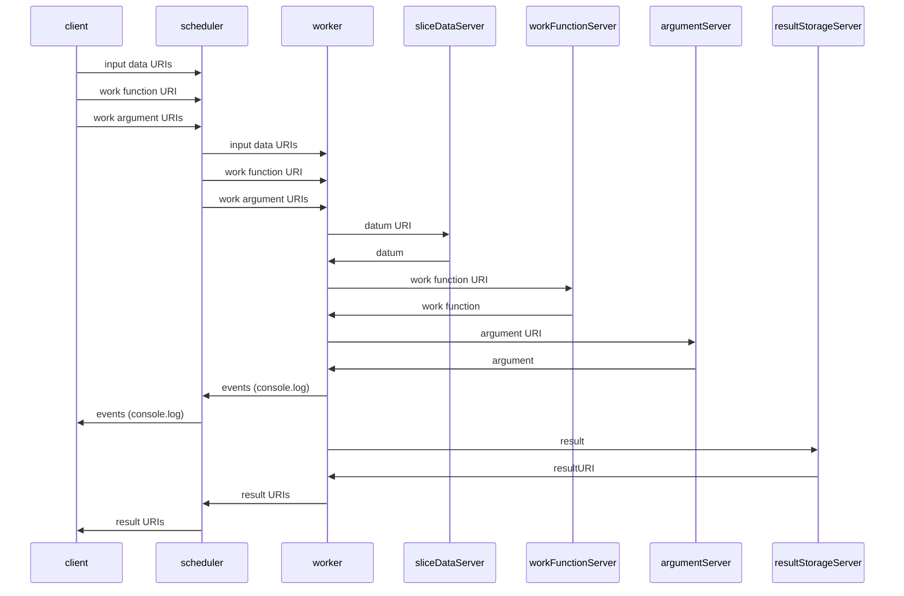

# DCP Remote Data Service

This is the official reference implementation of a DCP Remote Data Service.  While `dcp-rds` *can* be used as a production service, its purpose is primarily to demonstrate how to write a Remote Data Service service for DCP.

## Record Of Issue
| Date       | Author              | Change
:----------- |:------------------- |:---------------------------------------------
| Oct 8 2021 | Wes Garland         | Initial Release

## Legal (MIT License)
Copyright (c) 2021 Kings Distributed Systems, Ltd.

Permission is hereby granted, free of charge, to any person obtaining a copy of this software and associated documentation files (the "Software"), to deal in the Software without restriction, including without limitation the rights to use, copy, modify, merge, publish, distribute, sublicense, and/or sell copies of the Software, and to permit persons to whom the Software is furnished to do so, subject to the following conditions:

The above copyright notice and this permission notice shall be included in all copies or substantial portions of the Software.

THE SOFTWARE IS PROVIDED "AS IS", WITHOUT WARRANTY OF ANY KIND, EXPRESS OR IMPLIED, INCLUDING BUT NOT LIMITED TO THE WARRANTIES OF MERCHANTABILITY, FITNESS FOR A PARTICULAR PURPOSE AND NONINFRINGEMENT. IN NO EVENT SHALL THE AUTHORS OR COPYRIGHT HOLDERS BE LIABLE FOR ANY CLAIM, DAMAGES OR OTHER LIABILITY, WHETHER IN AN ACTION OF CONTRACT, TORT OR OTHERWISE, ARISING FROM, OUT OF OR IN CONNECTION WITH THE SOFTWARE OR THE USE OR OTHER DEALINGS IN THE SOFTWARE.

### Icon
The "Pizza Slice" icon associated with but not part of dcp-rds was made by [turkkub](https://www.flaticon.com/authors/turkkub) from [Flaticon](https://www.flaticon.com).

## About
DCP allows software developer who write DCP Client Applications to map an input set to an output set via a work function and a work argument.  The typical data flow has the client sending the input set, work function, and work argument to the centralized scheduler, which mediates all communication with the workers.  A DCP Remote Service provides a mechanism for clients and workers to communicate directly with data sources or sinks.
 
A DCP Remote Data Service consists of two parts,
 1. a program which can receive data from a remote entity, and
 2. a program which can send this data to clients and workers when they ask for it

For the reference implementation, we have chosen to write both #1 and #2 into a single Node.js program. We foresee many implementations where #1 and #2 are nothing more than `ftpd` and `httpd` with carefully-crafted file extensions and `mime.types`.

## Interface
1. An HTTP POST is made to the server (dcp-rds-httpd), which records the content to disk. The server responds with HTTP status 200, content-type `application/json`; the response body is a JSON-stringified object.
2. Workers make an HTTP GET request to dcp-rds-httpd, which responds with the content on disk.
3. Content stored within the dcp-rds is uniquely identified by the tuple (job, elementType, element).

### methods/upload
#### POST Parameters
##### job
This is a unique identifier for the job. It can be any unique string that describes the data that the job is for.  Future versions of DCP will support UUIDs which are calculated for jobs before deployment; this would be a good choice for this parameter.

##### elementType
The type of element that is stored within the job, for example 'slice', 'argument', 'work-function', etc.

##### element
Combined with elementType, this is a unique identifier for the content within the job. For example, if the elementType is 'slice', a good element might be the sliceNumber.

##### content
This is the content to store that corresponds to the tuple (job, elementType, element). The uploaded datum will not be interpreted in any way; the worker will receive exactly the same bytes for this slice as the `dcp-rds-httpd` daemon did. The content-type will also be preserved from the upload, however, note that is it possible for both this server  and intermediary web servers and caches to transparently alter the content transfer encoding, etc.

##### contentType
The MIME type of the content, after it has been decoded from the form upload.

#### Response
##### Successful
| Property | Value
|:---------|:------------------------------------------------------------------------------
| success  | true
| href     | a full URL which gives the path from which this datum may be downloaded

##### Failure
| Property | Value
|:---------|:------------------------------------------------------------------------------
| success  | false
| error    | optional instance of Error.  If present, may have also have non-standard stack and code properties.

#### Integration with compute::RemoteDataPattern
When using compute::RemoteDataPattern to store input data, we recommend using the elementType 'slice' and using the sliceNumber for the element during the upload.
This will all the datum to be in a deterministic (pattern) location, given by `${website origin}/methods/download/jobs/${job}/slice/${slice}`

*Note:* As of this writing (Oct 2021), developers currently need to generate their own unique jobIds and use a per-job pattern with it hard-coded within the pattern, as there is no way to get a job Id from the scheduler before deployment. This will be addressed in a future version of the Compute API.

#### Integration with compute::RemoteDataSet
In all cases, the response indicates the location from which the uploaded datum can be retrieved.

When either the job or element parameters are missing, the remote data service will generate a random identifier to take its place. This allows the uploading of content whichhas not yet been associated with a job, but makes it imperative that the href URL in the reponse is memoized so that the content can be located later when the job is deployed.

### methods/upload-set
*Note* - As of this writing (Oct 2021), this method has not been implemented.

#### POST Parameters
##### job
See: methods/upload

##### content
Specifies the entire input set for this job and must be an Object which has been serialized either with JSON or KVIN. Serialization type will be automatically detected, but any data type which requires application/x-kvin output (eg TypeArrays, see table below) must be uploaded in KVIN to preserve type information correctly.

The service will intelligently decide how to store the data on disk, and will serialize it for transmission to the worker using whatever serialization is appropriate for the content type.

##### contentType
The content type of the data will be automatically determined after it has been extracted from the uploaded Array, evaluated on a per-element basis. If the initial serialization 
is done correctly, the JS type used in the uploaded Array will be the same as the JS type the Worker receives as its work function argument, or slice datum.

The following table lists the internal representation which is used to achieve this, but should be considered an implementation detail. The table is traversed in top-to-bottom 
order, with the first match being used.

| **JS Type** | **MIME Type** 
|:------------|:----------------------------------
| string      | text/plain
| number &isinv; (-Infinity, Infinity) | application/x-json
| number      | application/x-kvin
| Uint8Array  | application/octet-stream
| TypedArray  | application/x-kvin
| other       | application/x-kvin

#### Response
##### Successful
| Property | Value
|:---------|:------------------------------------------------------------------------------
| success  | true
| pattern  | a pattern string which can be used to retrieve this data, suitable for use with compute::RemoteDataSet
| length   | number of elements in the request

##### Failure
| Property | Value
|:---------|:------------------------------------------------------------------------------
| success  | false
| error    | optional instance of Error.  If present, may have also have non-standard stack and code properties.

### Content-Types
DCP workers uses the HTTP content-type header to sort out what kind of serialization (if any) is in use for a given HTTP request.  (See: `fetchURI()`)

**Important:** the `contentType` of the data in the POST request is generally not the same as the `Content-Type` header of the POST request; if you are developing a content uploader, it is important not to conflate the two!

| **MIME Type**                      | **Return Type**
|:-----------------------------------|:-------------------------------------------------------------------------------------------------
| text/plain or none                 | string primitive |
| text/*                             | An instance of String with the contentType property set, and the charset property set if it was specified
| application/json                   | whatever JSON.parse returns on the data when it is treated as a string
| application/x-kvin                 | whatever kvin.deserialze returns on the data when it is treated as a string
| image/*                            | A Uint8Array of the decoded contents with the contentType property set.
| application/octet-stream           | A Uint8Array of the decoded contents with the contentType property set and the charset property set if it was specified.
| Anything else                      | Same as application/octet-stream

## Installing

`dcp-rds-httpd` is a simple web server that can communicate directly over HTTP, but the typical way system administrators deploy this product is to have it listen to localhost and communicate with the outside world via proxy with a full-featured web server, such as nginx or Apache httpd.  These servers allow administrators to configure access control, TLS certificates, sophisticated logging, etc., as well as interoperation with local firewalls and other content on the same host.

*Do not expose dcp-rds-httpd directly to the internet without access controls in place!!!*

### Prerequisites
* Ubuntu Linux 20.04
* Node.js 12+
* nginx or Apache httpd
* Knowledge of organizational security policies and ability to implement them with Apache or nginx.

### Common
```bash
PREFIX="/var/dcp-rds"
```

#### Package install
```bash
sudo useradd -d "${PREFIX}" -M -s /bin/false dcp-rds
sudo mkdir -p "${PREFIX}" 
sudo chown dcp-rds:dcp-rds "${PREFIX}"
sudo npm i dcp-rds --global --prefix="${PREFIX}"
```

#### Systemctl Integration
```bash
sed -e "s;/var/dcp-rds/;${PREFIX}/;" \
< "${PREFIX}/systemctl/dcp-rds.service" \
| sudo sh -c 'cat > /etc/systemd/system/dcp-rds.service'
sudo systemctl daemon-reload
sudo systemctl restart dcp-rds
```

#### nginx Integration

#### Apache Integration

- now edit apache confs
- copy systemctl stuff
- systemctl daemon-reload
- systemctl start whatever this thing is call

## Appendix A - Manifest

| **Filename**                   | **Description**
|:-------------------------------|:----------------------------------------------------
| README.md                      | This document
| bin/dcp-rds-httpd              | Remote Data Service daemon; web server written in Node.js
| etc/config.js                  | Configuration object
| etc/local-config.js            | If present, overrides properties of etc/config.js
| libexec/                       | JS code in this directory can be executed on the local machine by a remote entity
| browser-test/upload.html       | Test harness - web page to upload data into the service
| systemctl/                     | Sample configuration files for systemctl
| apache/                        | Sample configuration files Apache httpd
| nginx/                         | Sample configuration files for nginx

## Appendix B - Remote URI Data Movement
**Note:** It is possible to freely mix remote URI and scheduler-centric URIs (traditional DCP) within the same job, at will, on an ad-hoc basis.

The dcp-rds-httpd program can be used for any of the server elements in this diagram:



## Appendix C - Compute API support for Remote Data
* RemoteDataSet
* RemoteDataPattern
* JobHandle.setResultStorage

```javascript
let job = compute.for(inputSet, new URL('http://my.site.com/work.js'));
```

```javascript
let { RemoteDataPattern } = require('dcp/compute');
let myJobId = Math.random();
let pattern = 'http://dcp-rds.site.com/methods/download/jobs/${myJobId}/slice/{slice}';
let job = compute.for(RemoteDataPattern(pattern, 2), function(el) { console.log(el)});
job.on('console', console.log)
await job.exec();
```

```
job.setResultStorage(new URL('https://192.168.123.1/submit-result'), { juuid: job.uuid });
```
<!--stackedit_data:
eyJoaXN0b3J5IjpbMTc5NjI5NTQ0MSwtMTU3MjcyMzgxNCwtMj
ExODgzMzY1NCwtNDY4MDkyMTc2XX0=
-->
